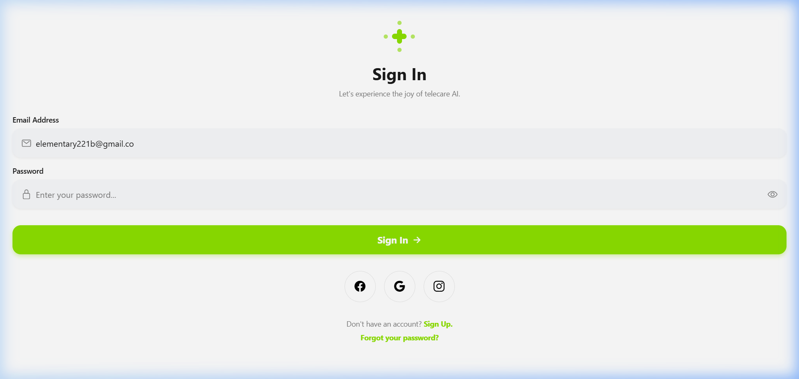
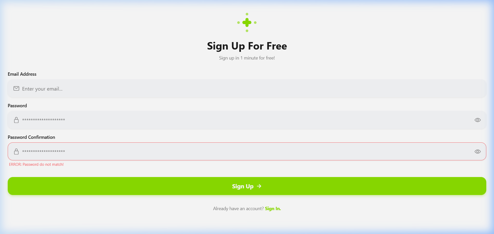
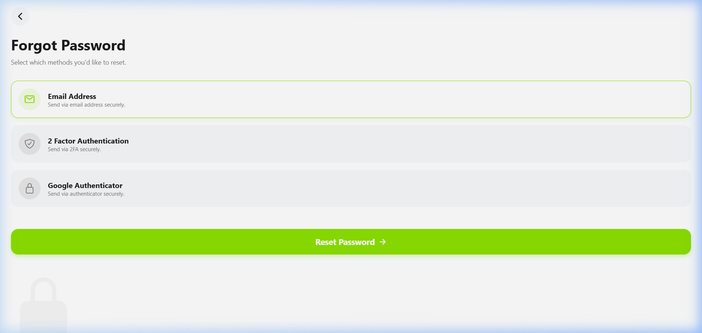

# Osler AI Telehealth UI Implementation

This project is a high-fidelity recreation of the Osler AI Telehealth mobile authentication UI using React Native and Expo.

## Features
- **Sign In Screen**: Clean layout with custom inputs, primary action button, and social login options.
- **Sign Up Screen**: Registration flow with password confirmation and simulated error states.
- **Forgot Password Screen**: Interactive reset method selection with custom styled radio-like cards.
- **Responsive Design**: Adapts to various screen sizes using flexbox and standard React Native layout principles.
- **Custom Components**: Built from scratch using core React Native components (`View`, `Text`, `TouchableOpacity`, `TextInput`).

## Tech Stack
- **React Native** (Core Components)
- **Expo** (Managed Workflow)
- **Expo Router** (Navigation)
- **Expo Vector Icons** (Iconography)

## Screenshots




## Getting Started

1. Install dependencies:
   ```bash
   npm install
   ```

2. Start the project:
   ```bash
   npx expo start
   ```

3. Open in your preferred environment (iOS Simulator, Android Emulator, or Expo Go).
